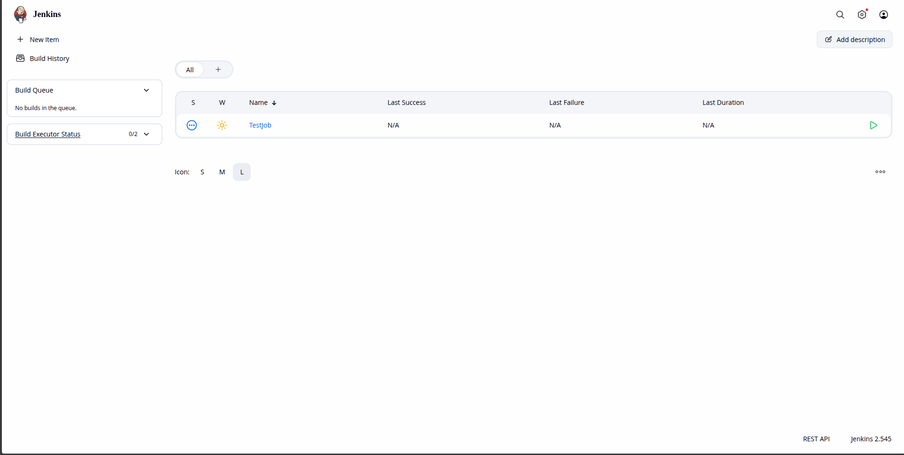

### Demo

1. Open your terminal.
2. `docker run ubuntu:latest cat /etc/*release*`: This command runs a Docker container using the latest Ubuntu image and displays the contents of the release files, which contain information about the Ubuntu version.
3. If you run `docker run ubuntu:latest sleep 1000`, you can open another terminal and execute `docker ps` to see the running container. You can stop it by using `docker stop <container_id>`, replacing `<container_id>` with the actual ID of the running container.
4. You can use the `-d` flag to run a container in detached mode. For example, `docker run -d ubuntu:latest sleep 1000` will run the container in the background.
    - You can use the `docker attach <container_id>` command to go back to the running container.

#### Jenkins Demo

1. `docker pull jenkins/jenkins`: This command pulls the official Jenkins image from Docker Hub.
2. `docker run -d -p 8080:8080 -p 50000:50000 --name jenkins jenkins/jenkins`: This command runs a Jenkins container in detached mode, mapping port 8080 on the host to port 8080 in the container (for the Jenkins web interface) and port 50000 for Jenkins agents.
3. Open your web browser and navigate to `http://localhost:8080` to access
4. Administer Jenkins. You will be prompted to enter the initial admin password.
5. To find the initial admin password, run `docker exec jenkins cat /var/jenkins_home/secrets/initialAdminPassword` in your terminal. This command executes a command inside the running Jenkins container to display the initial admin password.
6. Copy the password and paste it into the Jenkins setup page to proceed with the installation and configuration of Jenkins. the Jenkins web interface.
    - Or you can use the Docker extension in VS Code to manage and interact with your Jenkins container.
7. Create a folder on your host machine to store Jenkins data persistently (E.g., my-jenkis-data). 
8. Store the jenkins data: `docker run -d -p 8080:8080 -p 50000:50000 --name jenkins -v /path/to/my-jenkis-data:/var/jenkins_home jenkins/jenkins`: This command runs the Jenkins container with a volume that maps a directory on your host machine to the Jenkins home directory inside the container, ensuring that your Jenkins data is stored persistently.

HomePage: 